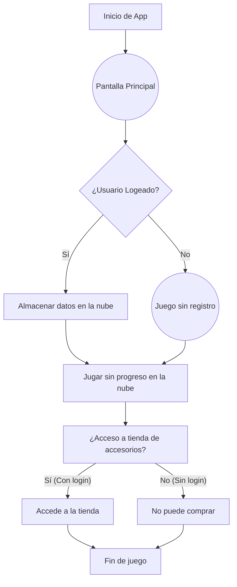
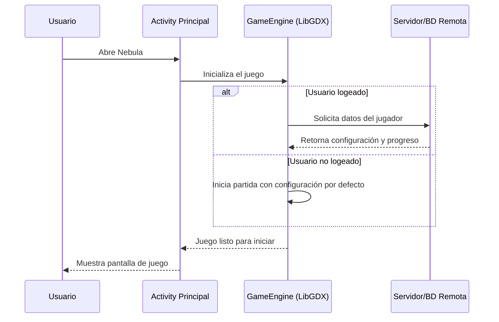
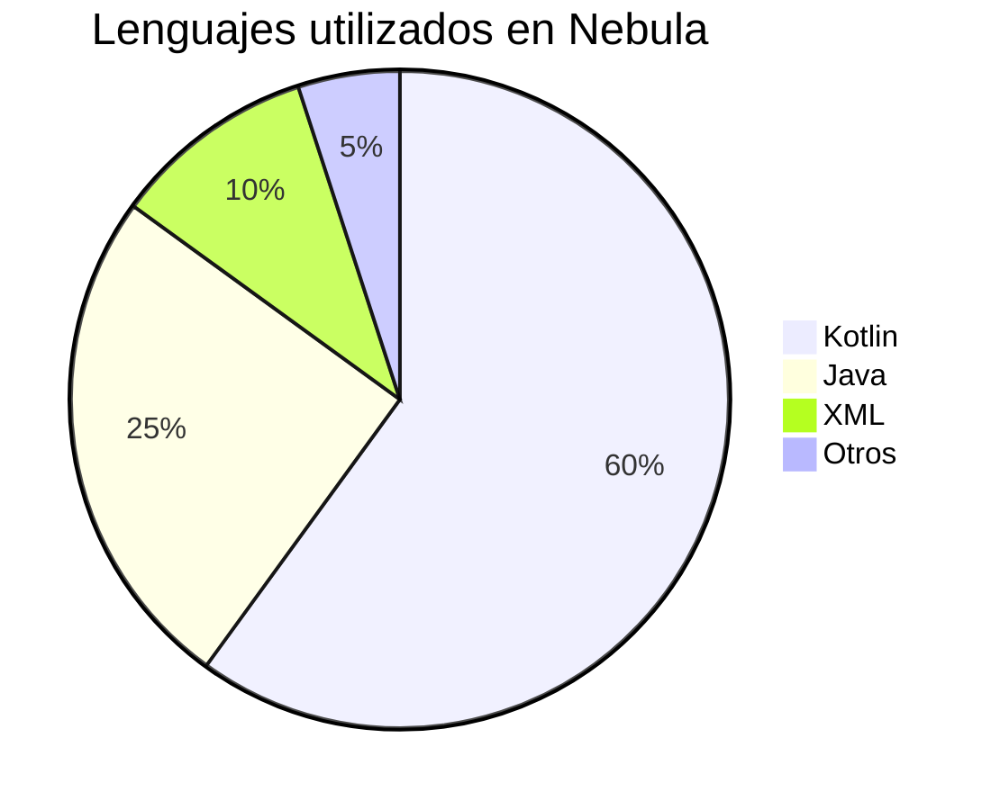
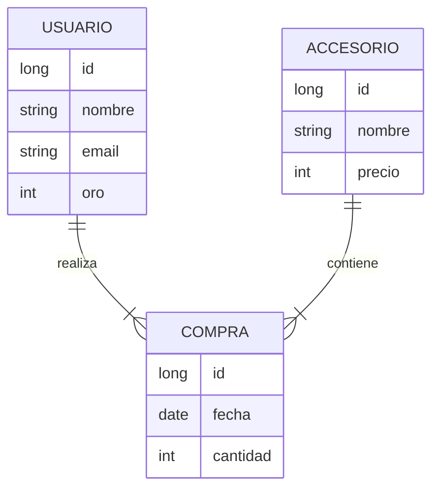
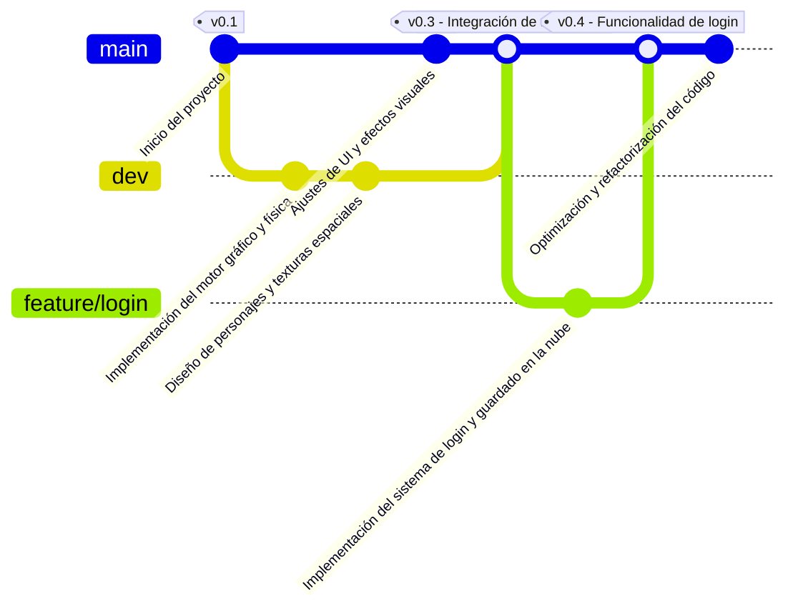

# Nebula 🚀

**Nebula** es juego inspirado en *Jetpack Joyride* ambientado en el espacio, donde el jugador controla a un astronauta que debe esquivar agujeros negros y obstáculos. ***Nebula*** combina la acción y la física de desplazamiento lateral con una temática espacial única.

---

## Tabla de Contenidos

- [Instalación](#instalación)
- [Uso Básico](#uso-básico)
- [Funcionalidades Principales](#funcionalidades-principales)
- [Tecnologías Utilizadas](#tecnologías-utilizadas)
- [Fragmentos de Código](#fragmentos-de-código)
  - [Inicialización y Configuración Básica](#fragmento-1-inicialización-y-configuración-básica-del-juego)
  - [Gestión de Colisiones y Obstáculos](#fragmento-2-gestión-de-colisiones-y-actualización-de-obstáculos-espaciales)
  - [Pantalla de Splash e Inicio de la Actividad Principal](#fragmento-3-manejo-de-la-pantalla-de-splash-e-inicio-de-la-actividad-principal)
- [Diagramas](#diagramas)
  - [Diagrama de Flujo](#diagrama-de-flujo)
  - [Diagrama de Secuencia](#diagrama-de-secuencia)
  - [Gráfico Circular](#gráfico-circular)
  - [Diagrama ER](#diagrama-entidad-relación-er)
  - [Diagrama Git](#diagrama-git)
- [Créditos y Licencia](#créditos-y-licencia)
- [Contacto](#contacto)

---

## Instalación

Para instalar y ejecutar **Nebula**:

1. **Descargar la APK:** Descarga la última versión desde la [página de lanzamientos](#).
o
1. **Clonar el repositorio para desarrolladores:**
   ```bash
   git clone https://github.com/tuusuario/nebula.git
   cd nebula
   ```
2. **Abrir en Android Studio:** Abre el proyecto en **Android Studio** y sincroniza el proyecto.

---

## Uso Básico

- Inicia la app y disfruta de la pantalla de splash.
- Controla al astronauta con **toques en la pantalla** para esquivar agujeros negros y obstáculos.
- Recoge oro durante la partida para desbloquear **cosméticos**.
- La **tienda** solo estará disponible si el usuario ha iniciado sesión.

> "El espacio es infinito y las posibilidades, también."  
> _¡Diviértete explorando Nebula!_

---

## Funcionalidades Principales

- **Juego de un solo jugador**
- **Acumulación de oro para cosméticos**
- **Modo sin registro (con limitaciones)**
- **Física realista en desplazamiento lateral**

---

## Tecnologías Utilizadas

- **Kotlin**
- **Java**
- **Android Studio**
- **LibGDX**
- **IntentNavigator**

### Badges de Tecnología

[](https://kotlinlang.org/)  
[](https://developer.android.com/studio)  
[](https://libgdx.com/)

---

## Fragmentos de Código

### Fragmento 1: Inicialización y Configuración Básica del Juego
```kotlin
// Ejemplo: Inicialización de la escena principal de Nebula
class NebulaGame : ApplicationAdapter() {
    private lateinit var batch: SpriteBatch
    private lateinit var background: Texture
    private var astronautY: Float = 0f
    private var velocity: Float = 0f
    private val GRAVITY = 2f

    override fun create() {
        batch = SpriteBatch()
        background = Texture("space_bg.png")
        astronautY = Gdx.graphics.height / 2f
    }

    override fun render() {
        if (astronautY > 0) {
            velocity += GRAVITY
            astronautY -= velocity
        }
        batch.begin()
        batch.draw(background, 0f, 0f, Gdx.graphics.width.toFloat(), Gdx.graphics.height.toFloat())
        batch.end()
    }
}
```

### Fragmento 2: Gestión de Colisiones y Actualización de Obstáculos Espaciales
```kotlin
for (i in 0 until numberOfObstacles) {
    if (obstacleX[i] < -obstacleWidth) {
        obstacleX[i] += numberOfObstacles * distanceBetweenObstacles
        obstacleOffset[i] = (random.nextFloat() - 0.5f) * (Gdx.graphics.height.toFloat() - GAP - 200f)
    } else {
        obstacleX[i] -= OBSTACLE_VELOCITY
    }
    batch.draw(obstacleTexture, obstacleX[i], Gdx.graphics.height / 2f + GAP / 2 + obstacleOffset[i])
}
```

### Fragmento 3: Manejo de la Pantalla de Splash e Inicio de la Actividad Principal
```kotlin
@SuppressLint("CustomSplashScreen")
class SplashActivity : Activity() {
    override fun onCreate(savedInstanceState: Bundle?) {
        super.onCreate(savedInstanceState)
        setContentView(R.layout.activity_splash)
        findViewById<Button>(R.id.playButton).setOnClickListener {
            IntentNavigator.startMainActivity(this)
        }
    }
}
```

---

---

## Diagramas

### Diagrama de Flujo


### Diagrama de Secuencia


### Gráfico Circular


### Diagrama Entidad-Relación (ER)


### Diagrama Git


---

## Estado de Implementación de Funcionalidades

| Funcionalidad             | Estado  |
| ------------------------- | ------- |
| Modo Infinito             | ✔       |
| Tienda                    | ✔       |
| Multijugador              | ✖       |
| Ranking Online            | ✖       |

---

## Créditos y Licencia

**Autor:** Andoni, estudiante de CFGS de DAM  
**Licencia:** [MIT License](https://opensource.org/licenses/MIT)

---

## Contacto

- **GitHub:** [Andoni en GitHub](https://github.com/andoni)
- **Correo:** [andoni@example.com](mailto:andoni@example.com)
- **Sitio Web de Kotlin:** [Kotlin Official Site](https://kotlinlang.org/)  
- **Enlace con Título:** [Más información sobre Android Studio](https://developer.android.com/studio)

---

###### ¡Gracias por explorar Nebula! 😄✨
